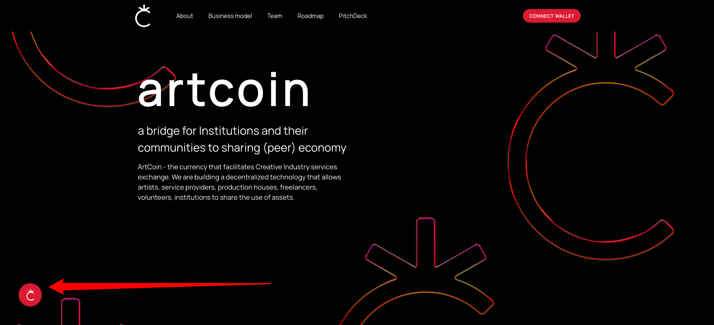
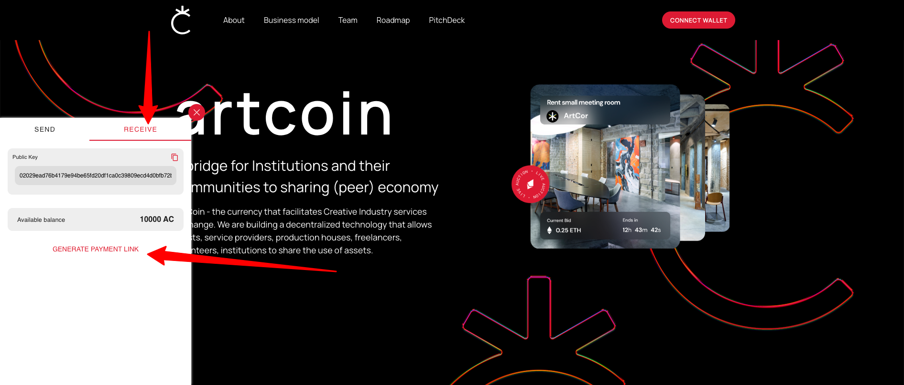
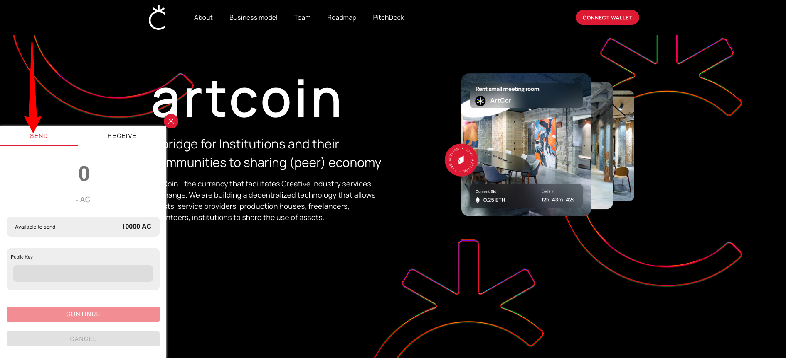
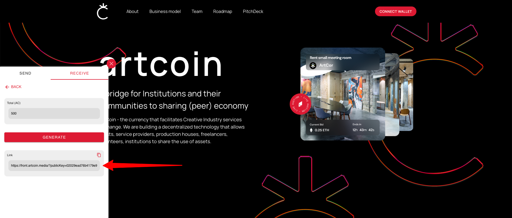

# ArtCoin Technology installation and usage instruction


### Table of Content:

1. [Library Description](#library-description)
2. [Project Description](#project-description)
3. [Installation of ArtCoin Technology](#installation)
4. [Configuration of ArtCoin Technology](#configuration)

<a id="library-description"></a>

## Library Description

This document represents the instruction on how to use ArtCoin Currency and ArtCoin Technology

<a id="project-description"></a>

## Project Description

ArtCoin - a Sharing Economy tool that facilitates the exchange of assets within the Creative Community and the usage of
underutilized assets.
ArtCoin is a bridge for Institutions and their communities to a sharing economy.
ArtCoin.
We are building:

1. <b>ArtCoin currency:</b> an exchange coin for the underutilized assets
2. <b>ArtCoin technology:</b> a technology that allows individuals and entities to exchange their underutilized assets (
   similar to PayPal smart buttons)

<a id="installation"></a>

## Installation of the ArtCoin Technology

In order to install the ArtCoin Technology on Your Web Application, please add the following script in your main html
file, before closing the </body>
tag: ```<script type="module" src="https://cdn.jsdelivr.net/gh/likedevs/artcoin-cdn/src/artcoin.js"></script> ```
As result, an iframe will be displayed on Your web app, that will allow Your users to:

1. Authorize with their Casper Wallet
2. View available balance in ArtCoin
3. Make transfers in ArtCoin (send/receive)
4. Generate Payment Links

The ArtCoin Technology works, as it is shown on the following screens:






<a id="configuration"></a>

## Configuration of the ArtCoin Technology

There are 2 options available to be displayed on Your web application:

1. You buy services/goods through ArtCoin from Your users
2. You sell services/goods through ArtCoin to Your users


<b>Option 1: Buy</b>

In order to buy services/goods through ArtCoin You will have to add the ArtCoin Smart button, alongside with the title,
description and other details, related to the service/good, that You are willing to buy. In order to do that, You will
have to add the following code snippet to Your web app:

```
<div class="artcoin-btn-buy-service" 
    price="{ArtCoins_qty}">              
    {Button_text}
</div>
```

<b>ArtCoins_qty</b> - how much ArtCoins You are willing to pay for requested service/good

<b>Button_text</b> - the text displayed on the button, i.e. “Provide service”

After the user clicks on the button, a payment link shall be generated, that the user can send to the service/good
Acquirer (to You), when the service/good is prepared to be delivered.


<b>Option 2: Sell</b>

In order to sell services/goods through ArtCoin You will have to add the ArtCoin Smart button, alongside with the title,
description and other details, related to the service/good, that You are willing to sell. In order to do that, You will
have to add the following code snippet to Your web app:

```
<div class="artcoin-btn-sell-service" 
    price="{ArtCoins_qty}"
    owner="{Casper_Wallet_ID}">              
    {Button_text}
</div>
```

<b>ArtCoins_qty</b> - how much ArtCoins You are willing to get for requested service/good

<b>Button_text</b> - the text displayed on the button, i.e. “Get service”

<b>Casper_Wallet_ID</b> - Your Casper Wallet ID, at which You wish to receive the ArtCoins

After the user clicks on the button, the iframe will open on Your web app, with the payment amount inserted. The user
needs only to click the “Send” button to pay in ArtCoins for the good/service.